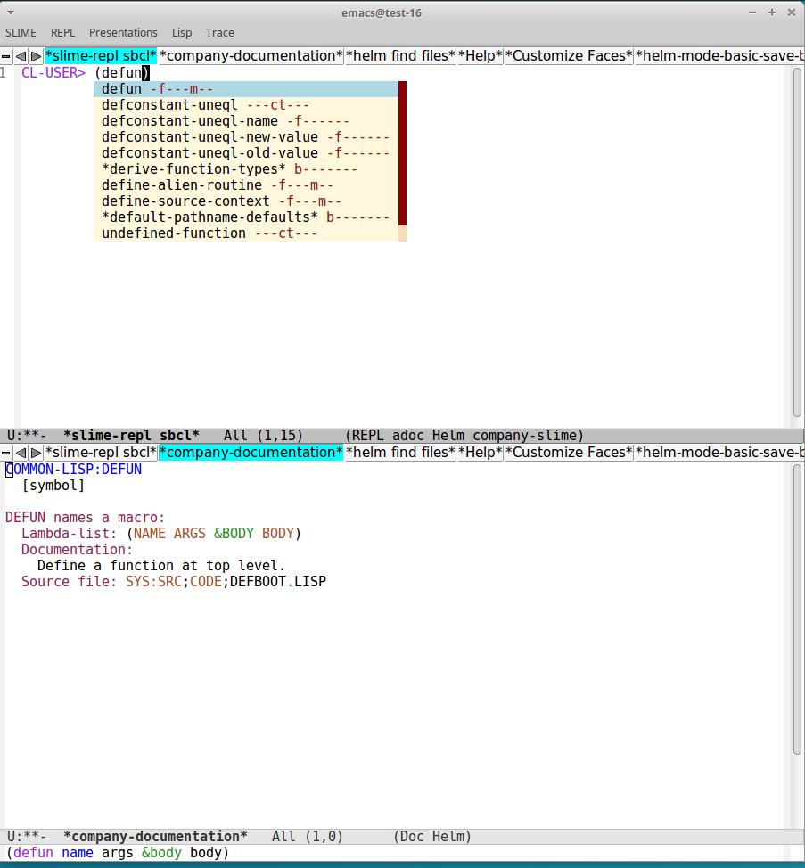

If you reached here from [this video](https://www.youtube.com/watch?v=GJ4i10U_zzg), please
see the [version tagged demo](https://github.com/digikar99/emacs-noob/tree/demo).

***

## Requirements

Emacs 26 and up! (Due to helm, 25 and up; due to a auto-complete dependency, 26 and up!.)

## Installation

Drop the `init.el` in your `~/.emacs.d/` and (re)start emacs.

Emacs will download `use-package` and then the required packages. This should take
a few minutes. Optionally, restart emacs.

<p align="center">

</p>

## On Startup

**Get an implementation**

- Get [an implementation](https://common-lisp.net/implementations): may be `sudo apt install sbcl # if you are using some linux distro`.

- If you are on android, the following steps should help you get an ECL up and working (credits to the [following doc](https://github.com/plops/ecl-termux-binary)):

```sh
apt update && apt install build-essential texinfo git
cd ~
git clone https://gitlab.com/embeddable-common-lisp/ecl.git
cd ecl
git checkout 20.4.24
./configure --prefix $HOME/.local --build=$(uname -m)-linux-android --enable-gmp=included
make -j4 # or whatever your number of cores
make install
```

**Install quicklisp**

- Download quicklisp: `wget http://beta.quicklisp.org/quicklisp.lisp -O ~/quicklisp.lisp`.

- Load quicklisp `/path/to/your/implementation --load ~/quicklisp.lisp` and follow the instructions. For example, for the android case above, this is `~/.local/bin/ecl --load ~/quicklisp.lisp`. In some cases, you might want to refer to `/path/to/your/implementation --help`or equivalent.

```lisp
(quicklisp-quickstart:install)
(ql:add-to-init-file)
(quit)
```

**Configure init.el**

- Drop the `init.el` in `.emacs.d`: `mkdir .emacs.d && wget https://raw.githubusercontent.com/digikar99/emacs-noob/slime-company/init.el -O ~/.emacs.d/init.el`.
- Now, change `(setq inferior-lisp-program "/usr/bin/sbcl")` in [init.el](./init.el) to point to the appropriate binary (say `/data/data/com.termux/files/home/.local/bin/ecl`). Place the cursor just beyond the closing parenthesis `)` and press `M-e`.

**Get Started**

- If there were any errors, preferably restart emacs: `M-q yes` to quit. And then start again.
- You may also want to learn about [emacs daemon](https://www.emacswiki.org/emacs/EmacsAsDaemon) - basically that `emacs --daemon` and `emacsclient` (and `C-x C-w` in our customization).
- Any of `M-x slime`, `M-l`, `open-slime` to start slime and start playing with Common Lisp.

## Features

- Melpa added
- Packages: use-package, tabbar-mode, ace-window, auto-complete, helm, goto-chg, slime, slime-company
- `C-x` bindings are disabled unless some specific mode binds them.
- global auto-complete-mode, electric-pair-mode, show-paren-mode, auto-revert-mode, visual-line-mode, linum-mode, column-number-mode, helm-mode
- Slower / less-jerky scroll

## Usage Intention

This branch `slime-company-modern` is intended for focusing on Common Lisp instead of *both* Common Lisp and Emacs. Users are *strongly discouraged* from using this in the longer run or for learning emacs. In the longer run, users might want to consider using the [master branch](https://github.com/digikar99/emacs-noob) or one of the more established [emacs starter kits](https://github.com/emacs-tw/awesome-emacs#starter-kit).

This does not touch paredit-mode or lispy or several other lisp helper modes. It is expected that as users gain familiarity with Common Lisp, they may touch these other "advanced" packages to help them with Common Lisp development... while opening their minds further at the same time.

## Branch Specialized for Common Lisp Development

- If you do not have access to a full blown emacs GUI and are stuck with a terminal-only version, you are better off with [slime-company-ecl](https://github.com/digikar99/emacs-noob/tree/slime-company-ecl)
- If you intend to learn emacs in the longer run, look towards [slime-company](https://github.com/digikar99/emacs-noob/tree/slime-company).

## Key-bindings

The intention is that `C-o`, `C-x`, `C-z` `<escape>` and several others should "just work". In case you think a particular key-binding should exist as default, feel free to raise an issue or a PR.

The key-bindings are available at [init.el](./init.el).

**Other partially non-standard key-bindings**

- C-l: Goto line
- M-l: Open slime repl
- M-b: Switch buffer
- M-q: Quit emacs (with prompt)
- M-o: Other window
- M-k: Delete line this point forward
- M-h k: Help key
- M-h v: Help variable
- M-h f: Help function
- M-S-<up>/<down>: Move line (selected region) up or down
- C-M-f: Forward search symbol at point
- C-M-h: Forward replace symbol at point

<br/>

- F7: Split window horizontally: "<f10>" is more memorable, but its bound to something
in some terminals
- F8: Split window vertically - two parts of the "8"
- F9: Expand window vertically
- F11 [std]: Toggle "frame" full screen
- S-F11: Delete other windows (this, to avoid accidentally pressing "<f11>" while
trying to go full screen)

<br/>

- M-m: ansi-term switch between line and char modes
- M-n: ansi-term next command
- M-p: ansi-term previous command

**SLIME (Intended) Key Bindings**

- M-l: Open slime repl
- C-c C-c: slime-compile-defun
- C-c C-d C-d: slime-describe-symbol
- C-x C-e: slime-eval-last-expression
- C-c C-e: macrostep-expand
- C-c C-t: slime-toggle-fancy-trace
- C-c C-p: slime-profile-toggle-fdefinition
- C-c M-r: slime-profile-report
- C-c C-r: slime-profile-reset
- M-.: slime-edit-definition
- M-,: slime-pop-find-definition-stack
