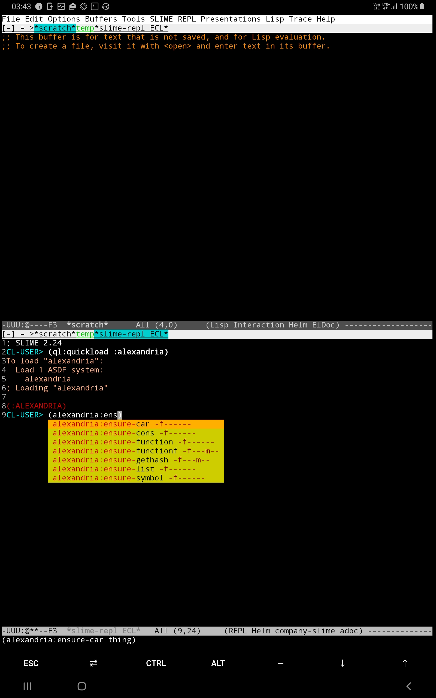

If you reached here from [this video](https://www.youtube.com/watch?v=GJ4i10U_zzg), please
see the [version tagged demo](https://github.com/digikar99/emacs-noob/tree/demo).

***

## Requirements

Emacs 26 and up! (Emacs 25 and up due to helm; emacs 26 and up due to an auto-complete dependency.)

<p align="center">

</p>

## Installation

Drop the `init.el` in your `~/.emacs.d/` and (re)start emacs.

Emacs will download `use-package` and then the required packages. This should take
a few minutes. Restart emacs.

## On Startup

**Get an implementation**

- Get [an implementation](https://common-lisp.net/implementations): may be `sudo apt install sbcl # if you are using some linux distro`.

- If you are on android, the following steps should help you get an ECL up and working (credits to the [following doc](https://github.com/plops/ecl-termux-binary)):

```sh
apt update && apt install build-essential texinfo
cd ~
git clone https://gitlab.com/embeddable-common-lisp/ecl.git
cd ecl
git checkout 20.4.24
./configure --prefix $HOME/.local --build=aarch64-linux-android --enable-gmp=included
make -j4 # or whatever your number of cores
make install
```

**Install quicklisp**

- Download quicklisp: `wget http://beta.quicklisp.org/quicklisp.lisp -O ~/quicklisp.lisp`.

- Load quicklisp `/path/to/your/implementation --load ~/quicklisp.lisp` and follow the instructions. For example, for the android case above, this is `~/.local/bin/ecl --load ~/quicklisp.lisp`. In some cases, you might want to refer to `/path/to/your/implementation --help`or equivalent.

```lisp
(quicklisp-quickstart:install)
(ql:add-to-init-file)
(quit)
```

**Configure init.el**

- Drop the `init.el` in `.emacs.d`: `mkdir .emacs.d && wget https://raw.githubusercontent.com/digikar99/emacs-noob/slime-company/init.el -O ~/.emacs.d/init.el`.
- Besides the [key bindings](#key-bindings) below, [this tutorial on emacs lisp](https://learnxinyminutes.com/docs/elisp/) should help you gain familiarity with the emacs workflow.
- Now, change `(setq inferior-lisp-program "/usr/bin/sbcl")` in [init.el](./init.el) to point to the appropriate binary (say `/data/data/com.termux/files/home/.local/bin/ecl`). (Got the hang of `C-x C-e`?)

**Get Started**

- If there were any errors, preferably restart emacs: `M-q yes` to quit. And then start again.
- You may also want to learn about [emacs daemon](https://www.emacswiki.org/emacs/EmacsAsDaemon) - basically that `emacs --daemon` and `emacsclient` (and `C-x C-w` in our customization).
- Any of `M-x slime`, `M-l`, `open-slime` to start slime and start playing with Common Lisp.

## Features

- Melpa added
- Packages: use-package, tabbar-mode, ace-window, auto-complete, helm, slime, company, slime-company
- `C-x` bindings not listed below are bound to nil: In case some exists that is missing below, it is a bug; report them! Known issue is `C-x 8-` key bindings which I've been unable to disable.
- global electric-pair-mode, show-paren-mode, auto-revert-mode, visual-line-mode, linum-mode, column-number-mode, helm-mode
- Slower scroll

## key-bindings

**text editing**

Bonus: [Several emacs key-bindings carry over to bash-based terminals!](https://superuser.com/questions/352983/which-emacs-shortcuts-are-useful-in-bash) So, these are useful beyond emacs as well!

- C-s [std]: Search (forward); because changing this means changing several other maps
and we don't want to go "too far" from vanilla emacs, so that you get used to it as well
- C-r: Replace (forward); because see C-h next
- C-h (Backspace): Delete word to the left - this is so because on the terminal backspace
and C-h are equivalent. And I haven't searched enough for a workaround.
- C-z: Undo - in emacs, redo is undo of undo; this also avoids loss of redo-undo "trees"
- `C-<space>` [std]: enter/exit text-selection mode
- C-x h [std]: Select all
- C-a [std]: Move cursor to start of line
- C-e [std]: Move cursor to end of line
- C-w [std]: Cut; because C-x is complicated
- C-y [std]: Paste; because
- C-v [std]: Scroll down
- M-v [std]: Scroll up
- C-g [std]: Cancel command
- C-k [std]: Cut line this point forward
- M-k: Delete line this point forward
- C-/: Un/comment-line; also works for un/commenting region when selected
- C-l: Goto line


- `M-S-<up>/<down>`: Move line (selected region) up or down
- C-M-s: Forward search symbol at point
- C-M-r: Forward replace symbol at point
- M-q: Quit emacs (with prompt)
- M-l: Open slime-repl


**Window and Buffer Management**

- F7: Split window horizontally: `<f10>` is more memorable, but its bound to something
in some terminals
- F8: Split window vertically - two parts of the "8"
- F9: Expand window vertically
- F11 [std]: Toggle "frame" full screen
- S-F11: Delete other windows (this, to avoid accidentally pressing `<f11>` while
trying to go full screen)
- C-o [~std]: Switch window
- M-o: Switch buffer

- C-t: Open `*scratch*` buffer
- C-S-t: Reopen closed file
- `C-<tab>` / `C-S-<tab>`: Switch tabs
- M-x [std]: arbitrary commands (helm-M-x)
- C-x C-f [std]: Open file (helm-find-files)
- C-x C-s [std]: Save file
- C-x C-d [~std]: Open directory. Press '?' for help. (dired)
- C-x C-w: Close file (kill-this-buffer)
- C-x C-r: Rename file (and buffer)
- C-x C-k: Delete this window

**Miscellaneous**

- M-h k: Help key
- M-h v: Help variable
- M-h f: Help function

- M-m: ansi-term switch between line and char modes
- M-n: ansi-term next command
- M-p: ansi-term previous command

